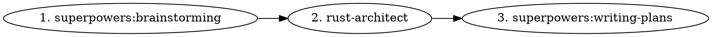

# Rust Project Kickoff

## Overview

Orchestrates three skills in sequence to produce a complete, plan-ready Rust project foundation. None of the three skills replaces the others — they operate at different layers and must all run.

## Skill Sequence

### 1. `superpowers:brainstorming` — *What are we building?*

Invoke first. Explore the problem space, consider alternatives, surface constraints and trade-offs before any structure is committed. Output: shared understanding of goals and boundaries.

### 2. `rust-architect` — *How do we structure it?*

Invoke after brainstorming converges. Produces the full documentation package: directory layout, guardrails (NEVER_DO / ALWAYS_DO), ADRs, domain model, concurrency patterns, Director/Implementor handoff docs. Output: a populated `docs/` tree.

### 3. `superpowers:writing-plans` — *What do we build first?*

Invoke after rust-architect completes. Translates the architecture into the first concrete implementation plan (YAML frontmatter, 2–5 min atomic tasks, acceptance criteria). Output: `docs/plans/PLAN-001-*.md`.

## Conflict Resolution

| Topic | Authority |
|-------|-----------|
| Process (when/how to work) | superpowers skills |
| TDD workflow | superpowers:test-driven-development |
| Rust content (what to produce) | rust-architect |
| Implementation plan format | superpowers:writing-plans (YAML frontmatter) |
| Director/Implementor model | rust-architect (Rust-specific framing) |

If rust-architect and a superpowers skill describe the same workflow differently, **follow the superpowers skill for process, rust-architect for Rust-specific content**.

## When NOT to Use

- Adding a feature to an existing project → use `superpowers:brainstorming` + `superpowers:writing-plans` directly
- Exploring architecture questions without committing to a project → use `rust-architect` alone
